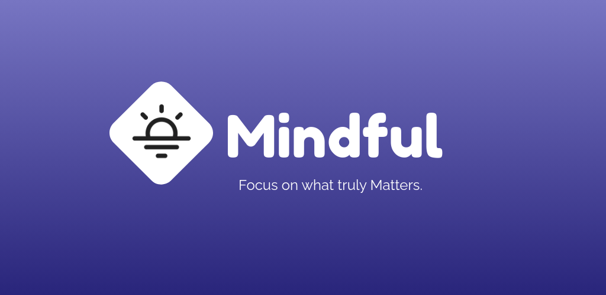
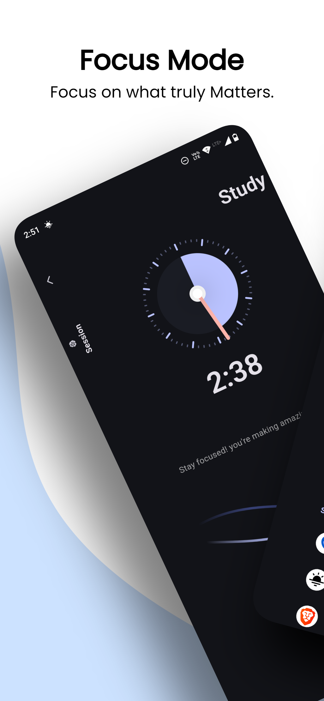
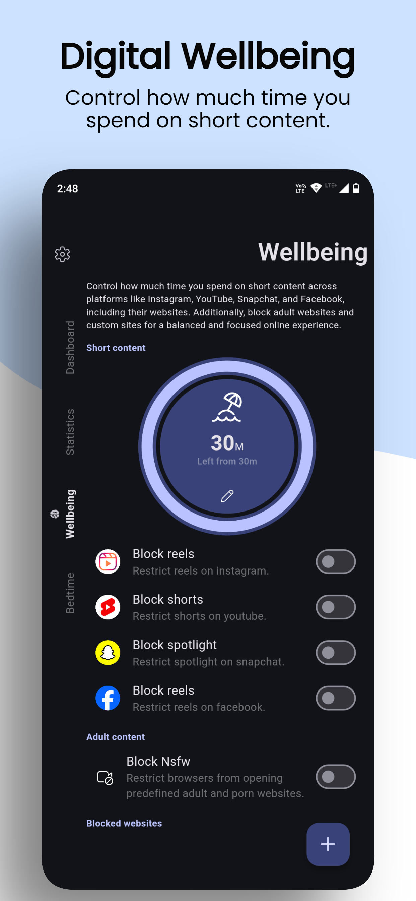
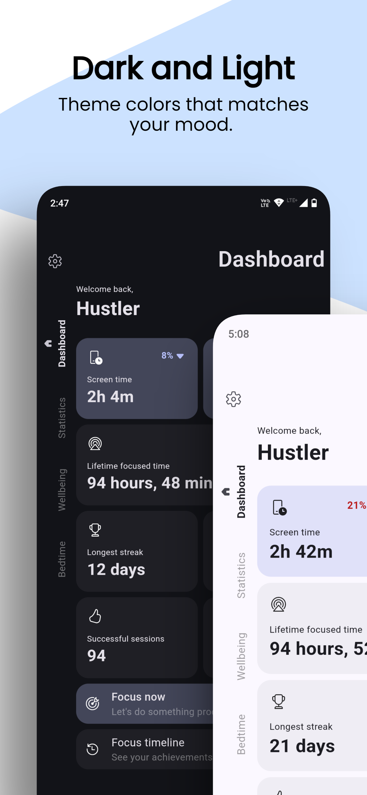
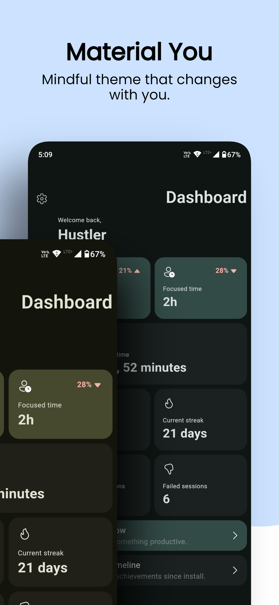

# Mindful

**Mindful** is a free and open-source app designed to help you regain control over your digital habits, improve your focus, and boost productivity. Whether you're battling social media addiction, struggling to stay focused, or simply looking for a way to better manage your screen time, Mindful is here to assist.

### [🛠️ Contribute](CONTRIBUTION.md)&emsp;&emsp; [💖 Donate](#-donate)&emsp;&emsp; [🔏 Privacy Policy](PRIVACY.md)

## 👇 Download

 
&emsp;

## 📱 Screenshots

|  |  |  |  |
| ------------------------------------------------- | ------------------------------------------------- | ------------------------------------------------- | ------------------------------------------------- |
|  |  |  |  |

## 💪 Features

### 1. 🧘‍♂️ **Focus Mode**

- **Boost Productivity**: Pause distracting apps and activate Do Not Disturb during focus sessions.
- **Customizable Sessions**: Choose from various session types like Study, Work, or Creative.
- **Track Your Progress**: Review your focus journey over time and see how much you've achieved.

### 2. 📲 **Screen Time Management**

- **Set Usage Limits**: Restrict the time you spend on any app, including addictive short-form content like Reels and YouTube Shorts.
- **Automatic Pausing**: When the timer runs out, the app pauses, helping you stay on track.

### 3. 🌛 **Bedtime Mode**

- **Unwind Effectively**: Automatically pause distracting apps and enable Do Not Disturb during bedtime to ensure a peaceful sleep.
- **Wake-Up Routine**: Start your day fresh by unblocking apps and resuming notifications.

### 4. 🌏 **Web Safety**

- **Block Adult Sites**: Ensure a safe browsing environment by blocking adult content.
- **Custom Website Blocking**: Add any distracting or unwanted websites to your blocklist.
- **One-Click Internet Block**: Instantly cut off internet access for specific apps, keeping distractions at bay.

### 5. ♾️ **Invincible Mode**

- **Stay Disciplined**: Prevent changes to timers and bedtime settings, and block the ability to uninstall Mindful without first disabling this mode.

### 6. 🚫 **Completely Ad-Free & Privacy-Focused**

- **No Ads**: Enjoy an uninterrupted experience without any ads.
- **Privacy First**: Mindful operates entirely offline, ensuring your data stays on your device.

---

## 🤔 Why We Developed Mindful ?

We were frustrated with our own excessive phone usage and the lack of privacy-friendly, free solutions that could help manage it. After finding no suitable app on the Play Store, we decided to create Mindful—an app that respects your privacy, is free to use, and offers the comprehensive features we needed to regain control of our digital lives.

## 🗨️ Feedback and Support

Your feedback is invaluable to us! If you have suggestions, encounter issues, or simply want to share your thoughts, please reach out to us on github.

---

# 💖 Donate

Mindful is a Free and Open Source Software (FOSS) that took months of dedicated, restless work to develop. If you find this app helpful, please consider making a donation to support our efforts and ensure continued development. Your generosity will help us keep improving and maintaining Mindful for everyone.
